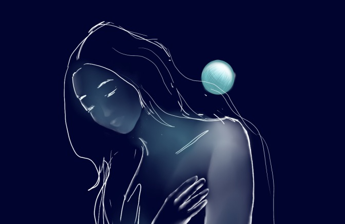

## Planetaria I

Si cada uno tiene un mundo  
el mío sería como Urano.  
Invierno eterno, frío profundo  
que nieva sobre mi pelo cano.  

Si alguien intenta sobrepasar los satélites  
y llegar a mi corazón turquesa.  
Si alguien pudiera abrazar  
Un núcleo de niebla espesa.  

¿Podría yo sentirlo?  
Porque temo que lo que antes era piel    
ahora es una coraza de hielo aislante.  
Ni las miradas ni los abrazos pueden alcanzarte.  

---

*Poema por Llanos Batanás Boza*
